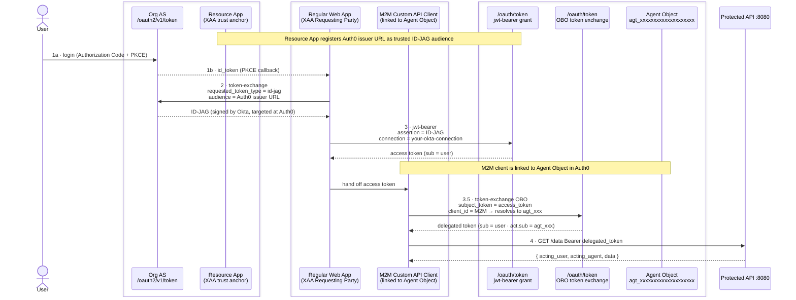

# XAA + Agent as a Principal

A working implementation of **Cross-App Access (XAA)** combined with **Agent as a Principal** — where Okta acts as the Identity Provider, Auth0 acts as the Resource Authorization Server, and an AI agent is a first-class identity principal in the final access token.

Built against:
- Auth0 Cross-App Access docs: https://auth0.com/docs/ai-agents-mcp/cross-app-access
- Auth0 Agent as a Principal docs: https://auth0.com/docs/ai-agents-mcp/agents-as-principal

---

## What this project demonstrates

Most agentic systems today use the user's identity to call downstream APIs — the agent is invisible in the token. This project shows how to make the agent a **named, auditable identity** in every token it uses, while still preserving the user's delegated identity.

The final access token carries two identities:

```json
{
  "sub":  "okta|user123",
  "act": {
    "sub": "agt_xxxxxxxxxxxxxxxxxxxx"
  }
}
```

- `sub` — the user the agent is acting for
- `act.sub` — the specific agent that made the request

The protected API can now answer: **"which user was accessed, and which agent did it."**

---

## Architecture



---

## Token flow

```
Step 1   User logs in to Okta (Authorization Code + PKCE)
             → Okta issues id_token

Step 2   Regular Web App exchanges id_token at Okta Org AS
             → Okta issues ID-JAG  (targeted at Auth0 tenant issuer)
             grant_type           = urn:ietf:params:oauth:grant-type:token-exchange
             requested_token_type = urn:ietf:params:oauth:token-type:id-jag
             audience             = https://your-tenant.auth0.com

Step 3   Regular Web App presents ID-JAG at Auth0 (jwt-bearer)
             → Auth0 validates ID-JAG against Okta JWKS
             → Auth0 looks up user via your-okta-connection enterprise connection
             → Auth0 issues access token:  sub = user
             grant_type = urn:ietf:params:oauth:grant-type:jwt-bearer
             assertion  = <ID-JAG>
             connection = your-okta-connection

Step 3.5 M2M client performs OBO token exchange at Auth0
             → Auth0 recognises M2M client is linked to agent object
             → Auth0 stamps act.sub = agent_id into new token
             → Token now carries both user and agent identity
             grant_type         = urn:ietf:params:oauth:grant-type:token-exchange
             subject_token      = <Step 3 access token>
             client_id          = <M2M client>   ← linked to agent object
             audience           = https://your-api-identifier/

Step 4   Agent calls protected API with OBO delegated token
             → API validates JWT, reads sub + act.sub
             → Returns { acting_user, acting_agent, data }
```

---

## Key concepts

### Cross-App Access (XAA)
XAA allows an agent to obtain a delegated access token for a downstream API using the user's identity from a different IdP — without requiring the user to log in again. Okta issues an **ID-JAG** (Identity Assertion Authorization Grant), a signed JWT that Auth0 accepts as proof of the user's identity.

The Okta **Resource App** is not a server or API — it is a trust configuration object that tells Okta: *"Auth0's issuer URL is a valid audience for ID-JAGs from this org."* It can be a Web App type because it does nothing active in the flow.

### Agent as a Principal
Without Agent as a Principal, the XAA flow produces a token where only the user's identity appears (`sub = user`). The agent is invisible — there is no way to tell which agent accessed the API.

Agent as a Principal introduces a registered **agent object** in Auth0 with a stable `agent_id`. When the agent's M2M client performs the OBO token exchange, Auth0 stamps `act.sub = agent_id` into the new token. The agent becomes a first-class identity alongside the user.

### Why the OBO exchange requires an M2M client

| Client type | Can do jwt-bearer (Step 3)? | Can do OBO (Step 3.5)? | Why |
|---|---|---|---|
| Regular Web App | Yes | No | Has no independent API authorization (`client_grant`). It only acts through user sessions. |
| M2M client | Yes | Yes | Has explicit API authorization (`resource_server_id` bound). Can assert its own standing as an actor. |

The Regular Web App in Step 3 is a **federation conduit** — it presents the user's credential and Auth0 issues a user token. The app itself is invisible.

The M2M client in Step 3.5 is an **autonomous actor** — it claims "I am the agent performing this action." For Auth0 to accept that claim, the client must have independent API authorization, which only M2M clients have.

### Why this matters at scale

| Without Agent as a Principal | With Agent as a Principal |
|---|---|
| `sub = user` only | `sub = user`, `act.sub = agent_id` |
| Logs show: "user accessed API" | Logs show: "user accessed API via agent Y" |
| Cannot distinguish agents | Per-agent audit trail |
| Cannot revoke one agent | Can revoke specific agent |
| No agent accountability | Full agent governance |

---

## Auth0 objects required

| Object | Type | Purpose |
|---|---|---|
| XAA API | Resource Server | Represents the protected API. Identifier = `https://your-api-identifier/` |
| XAA Requesting Party | Regular Web App | Performs jwt-bearer exchange (Steps 1–3). Must have `your-okta-connection` enterprise connection. |
| XAA Requesting Party — M2M | Machine to Machine | Performs OBO exchange (Step 3.5). Must be created from the API page (Custom API Client). |
| xaa-agent | Agent Object | Registered agent identity (`agt_xxxxxxxxxxxxxxxxxxxx`). Linked to the M2M client. |

---

## Project structure

```
A0_Agent as a Principal/
├── agent.py          # Core XAA + OBO logic (Steps 2–4). Importable module.
├── api_server.py     # Protected API: validates JWT, returns acting_user + acting_agent
├── ui.py             # Flask web UI: browser login, calls agent.py for Steps 2–4
├── templates/
│   └── index.html    # UI: shows all tokens with raw + decoded (jwt.io style) side by side
├── .env              # Your credentials (never commit)
├── .env.example      # Template with all required variables
└── requirements.txt
```

---

## Setup

### 1. Install dependencies

```bash
pip install -r requirements.txt
```

### 2. Configure `.env`

Copy `.env.example` to `.env` and fill in:

| Variable | Where to find it |
|---|---|
| `OKTA_DOMAIN` | Okta Admin → top-right org URL |
| `OKTA_CLIENT_ID` | Okta Admin → Applications → agent app → Client ID |
| `OKTA_CLIENT_SECRET` | Okta Admin → Applications → agent app → Client Secrets |
| `AUTH0_DOMAIN` | Auth0 Dashboard → Settings → Domain |
| `AUTH0_API_AUDIENCE` | Auth0 Dashboard → Applications → APIs → your API → Identifier |
| `AUTH0_CLIENT_ID` | Auth0 Dashboard → XAA Requesting Party (Regular Web App) → Client ID |
| `AUTH0_CLIENT_SECRET` | Auth0 Dashboard → XAA Requesting Party → Client Secret |
| `AUTH0_CONNECTION` | Auth0 Dashboard → Authentication → Enterprise → Okta connection → Name |
| `AUTH0_API_SCOPE` | Scope registered on Okta Resource App (e.g. `xaa:read`) |
| `OKTA_RESOURCE_AS_ISSUER` | Okta Admin → Security → API → Authorization Servers → Issuer |
| `AUTH0_AGENT_ID` | Auth0 Dashboard → AI Agents → your agent → Agent ID |
| `AUTH0_AGENT_CLIENT_ID` | Auth0 Dashboard → XAA Requesting Party M2M → Client ID |
| `AUTH0_AGENT_CLIENT_SECRET` | Auth0 Dashboard → XAA Requesting Party M2M → Client Secret |

### 3. Auth0 one-time configuration (UI steps)

All setup is done through the dashboards — no scripts needed.

---

#### A. Okta — Create the AI Agent app

1. Okta Admin → **Applications → Applications → Create App Integration**
2. Sign-in method: **OIDC - OpenID Connect** → App type: **Web Application** → Next
3. Name: `XAA Agent App`
4. Under **Advanced**, set **Application type** to `AI Agent` (enables the `ai_agent` profile)
5. Copy **Client ID** and **Client Secret** → `OKTA_CLIENT_ID`, `OKTA_CLIENT_SECRET`

---

#### B. Okta — Create the Resource App (XAA trust anchor)

This app is a trust configuration object, not a real API. It tells Okta that Auth0's issuer URL is a valid ID-JAG consumer.

1. Okta Admin → **Applications → Applications → Create App Integration**
2. Sign-in method: **OIDC - OpenID Connect** → App type: **Web Application** → Next
3. Name: `Auth0 Resource App` (or any name)
4. Under **Cross-App Access**, enable **Allow other applications to request access**
5. Set **Issuer URI** to `https://your-tenant.auth0.com` (your Auth0 domain, no trailing slash)
6. Add a scope: `xaa:read` → Save

---

#### C. Okta — Connect the Agent App to the Resource App

1. On the **XAA Agent App** → **Resource Connections** tab
2. Click **Add Connection** → select `Auth0 Resource App`
3. Select scope: `xaa:read` → Save
4. This enables Step 2: the agent app can now request an ID-JAG targeted at Auth0

> **Important:** Both apps must use the **Org AS** (`/oauth2/v1`), not the Default Custom AS. ID-JAG token type is only supported at the Org AS.

---

#### D. Auth0 — Create the Enterprise OIDC connection (Okta → Auth0)

1. Auth0 Dashboard → **Authentication → Enterprise → OpenID Connect → + Create Connection**
2. Name your connection (this becomes `AUTH0_CONNECTION`)
3. Issuer URL: `https://your-org.okta.com` (Okta domain)
4. Client ID / Secret: from the **XAA Agent App** in Okta (or create a dedicated OIDC app in Okta for this)
5. Save — copy the connection **Name** → `AUTH0_CONNECTION`

---

#### E. Auth0 — Create the API (Resource Server)

1. Auth0 Dashboard → **Applications → APIs → + Create API**
2. Name: `XAA API`
3. Identifier: `https://your-api-identifier/` → this becomes `AUTH0_API_AUDIENCE`
4. Signing Algorithm: **RS256** → Create
5. **Permissions** tab → **+ Add a Permission**:
   - Permission: `xaa:read` | Description: `Read access via XAA`
   - Save

---

#### F. Auth0 — Create the Regular Web App (jwt-bearer conduit)

1. Auth0 Dashboard → **Applications → Applications → + Create Application**
2. Name: `XAA Requesting Party` → Choose **Regular Web Application** → Create
3. **Settings** tab:
   - Allowed Callback URLs: `http://localhost:5000/callback`
   - Allowed Logout URLs: `http://localhost:5000`
   - Save Changes
4. Copy **Client ID** → `AUTH0_CLIENT_ID`
5. Copy **Client Secret** → `AUTH0_CLIENT_SECRET`
6. **Connections** tab → enable your Okta enterprise connection (from step D)

---

#### G. Auth0 — Create the M2M Client as a Custom API Client

> **Critical:** Create this from the **API page**, not the Applications page. Creating from the API page binds `resource_server_id` at creation — this is what Auth0 calls a "Custom API Client" and is required for the OBO token exchange.

1. Auth0 Dashboard → **Applications → APIs** → click your `XAA API`
2. Click the **Machine to Machine Applications** tab
3. Click **+ Create & Authorize New Application**
4. Name: `XAA Requesting Party — M2M` → **Create & Authorize**
5. Select scopes: check `xaa:read` → **Authorize**
6. Navigate to the new app: **Applications → Applications → XAA Requesting Party — M2M**
7. **Settings** tab → scroll to **Advanced Settings → Grant Types**
8. Enable: `urn:ietf:params:oauth:grant-type:token-exchange` → Save
9. Copy **Client ID** → `AUTH0_AGENT_CLIENT_ID`
10. Copy **Client Secret** → `AUTH0_AGENT_CLIENT_SECRET`

---

#### H. Auth0 — Create the Agent Object

1. Auth0 Dashboard → **AI** (or **Applications → AI Agents**) → **+ Create Agent**
2. Name: `XAA Agent`
3. Description: `Agent performing cross-app access on behalf of users`
4. Click **Create**
5. Copy the **Agent ID** (starts with `agt_`) → `AUTH0_AGENT_ID`

---

#### I. Auth0 — Link the Agent to the M2M Client

1. On the agent detail page (from step H)
2. Click **Link to Application** (or the **Clients** tab)
3. Select `XAA Requesting Party — M2M`
4. Confirm

This is the step that causes Auth0 to stamp `act.sub = agent_id` into OBO tokens produced by that M2M client.

---

#### Setup checklist

**Okta:**
- [ ] AI Agent app created with `ai_agent` profile → `OKTA_CLIENT_ID`, `OKTA_CLIENT_SECRET`
- [ ] Resource App (OIDC Web App) created with XAA enabled → Issuer URL = `https://your-tenant.auth0.com`
- [ ] Resource App assigned to Agent App via Resource Connections with scope `xaa:read`
- [ ] Both apps use Okta **Org AS** (`/oauth2/v1`), not Default Custom AS

**Auth0:**
- [ ] Enterprise OIDC connection pointing to Okta → `AUTH0_CONNECTION`
- [ ] API created → `AUTH0_API_AUDIENCE`
- [ ] Regular Web App created → `AUTH0_CLIENT_ID`, `AUTH0_CLIENT_SECRET`; Okta connection enabled
- [ ] M2M client created **from the API page** (Custom API Client) → `AUTH0_AGENT_CLIENT_ID`, `AUTH0_AGENT_CLIENT_SECRET`
- [ ] M2M client grant type `token-exchange` enabled (Advanced Settings → Grant Types)
- [ ] Agent object created → `AUTH0_AGENT_ID`
- [ ] Agent linked to M2M client

### 4. Provision user in Auth0 (one-time per user)

Auth0 does not support JIT provisioning via ID-JAG. Each user must log in via Auth0 Universal Login using the enterprise connection at least once to create their profile.

Click **"Step 0: Login via Auth0 (Okta)"** in the UI.

---

## Running

**Terminal 1 — API server:**
```bash
python api_server.py   # http://localhost:8080
```

**Terminal 2 — UI:**
```bash
python ui.py           # http://localhost:5000
```

**Browser:**
1. Open `http://localhost:5000`
2. Click **Step 0** (first time only) to provision your user
3. Click **Run XAA Flow**

The UI shows each token (raw + decoded payload side by side) and the final API response showing both `acting_user` and `acting_agent`.

---

## What a successful run looks like

**Terminal logs:**
```
[Step 1] Okta id_token acquired.
[Step 2] ID-JAG acquired from Okta.
[Step 3] Auth0 access token acquired.  sub=<user>
[Step 3.5] OBO delegated token acquired.  sub=<user>  act.sub=agt_xxxxxxxxxxxxxxxxxxxx
[Step 4] Calling protected API…
```

**API response:**
```json
{
  "message":      "Cross-App Access + Agent as a Principal successful!",
  "acting_user":  "okta|...",
  "acting_agent": "agt_xxxxxxxxxxxxxxxxxxxx",
  "data": [...]
}
```

---

## Key lessons from implementation

1. **Okta Org AS only** — ID-JAG token type is only supported at `/oauth2/v1`, not the Default Custom AS at `/oauth2/default/v1`.

2. **ID-JAG audience = Auth0 tenant issuer, no trailing slash** — must exactly match the Issuer URL on the Okta Resource App.

3. **The Okta Resource App is a trust anchor, not an API** — it being a Web App type is fine. It just registers Auth0 as a valid ID-JAG consumer.

4. **Regular Web App can do jwt-bearer but not OBO** — jwt-bearer is federation (presenting a user credential). OBO is autonomous action (asserting agent identity). Only M2M clients can assert their own standing.

5. **M2M client must be created from the API page** — creating it from the Applications page makes a generic `non_interactive` client. Creating it from the API's Machine to Machine Applications tab binds it as a Custom API Client with `resource_server_id`, which Auth0 requires for OBO.

6. **Token exchange grant must be explicitly enabled** — go to the M2M client → Advanced Settings → Grant Types → enable `urn:ietf:params:oauth:grant-type:token-exchange`.

7. **XAA and Agent as a Principal are independent concerns** — XAA solves "how do I get a user token across identity systems." Agent as a Principal solves "how do I stamp the agent's identity onto that token." If the user already has an Auth0 token from any flow, you can skip XAA and go straight to OBO.
